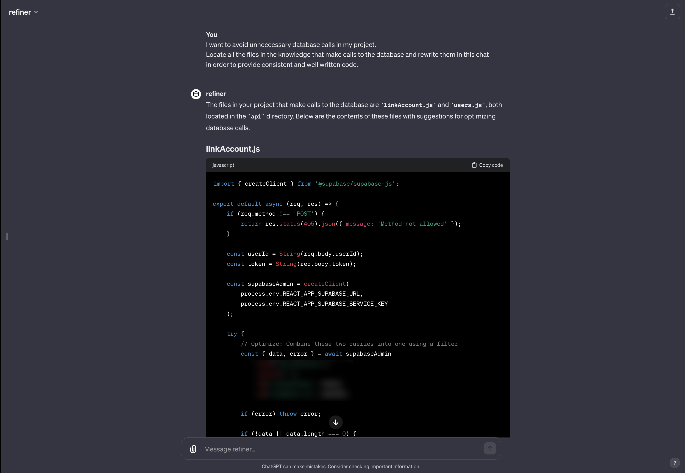

# GptKnowledgeHelper

This repository contains two Node.js scripts designed to provide a clear visualization of a project's directory structure. `ProjectJSON.js` creates a JSON representation of the directory, and `ProjectMarkdown.js` generates a markdown document.
I initially made it to help with my react project, so you may need to modify it based your file structure.

## Features

- **ProjectJSON.js**: Generates a JSON file containing the tree structure of the project directory, along with the contents of text files.
- **ProjectMarkdown.js**: Creates a markdown document that includes a navigable menu of the directory structure and the contents of each file.

## Getting Started

### Prerequisites

- Node.js installed on your system.

### Installation

1. Clone the repository to your local machine.
2. Navigate to the project directory in your terminal.

### Usage

- Run `node ProjectJSON.js` In the root directory of the project you'd like to structure to generate a JSON file of your project's code.
- Run `node ProjectMarkdown.js` In the root directory of the project you'd like to structure to generate a Markdown file of your project's code.

## Contributing

Pull requests are always welcome!
